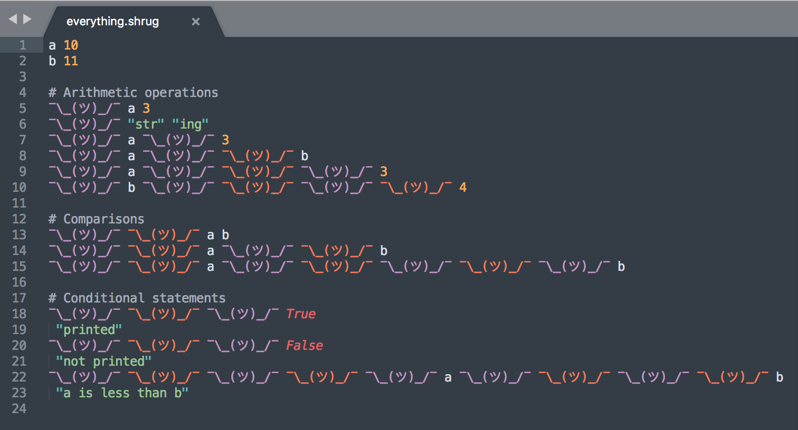

# ShrugProgrammingLanguage [](https://travis-ci.org/Ben-Wu/ShrugProgrammingLanguage) [](https://coveralls.io/github/Ben-Wu/ShrugProgrammingLanguage)

Interpreter for the Shrug Programming Language

Shrug is a imperative, dynamically-typed, very very high-level, general-purpose programming language

## Example

```sh
>> a 10
>> b 11
>>
>> # Arithmetic operations
>> ¯\_(ツ)_/¯ a 3
13
>> ¯\_(ツ)_/¯ "str" "ing"
string
>> ¯\_(ツ)_/¯ a ¯\_(ツ)_/¯ 3
7
>> ¯\_(ツ)_/¯ a ¯\_(ツ)_/¯ ¯\_(ツ)_/¯ b
110
>> ¯\_(ツ)_/¯ a ¯\_(ツ)_/¯ ¯\_(ツ)_/¯ ¯\_(ツ)_/¯ 3
3
>> ¯\_(ツ)_/¯ b ¯\_(ツ)_/¯ ¯\_(ツ)_/¯ ¯\_(ツ)_/¯ ¯\_(ツ)_/¯ 4
3
>>
>> # Comparisons
>> ¯\_(ツ)_/¯ ¯\_(ツ)_/¯ a b
False
>> ¯\_(ツ)_/¯ ¯\_(ツ)_/¯ a ¯\_(ツ)_/¯ ¯\_(ツ)_/¯ b
False
>> ¯\_(ツ)_/¯ ¯\_(ツ)_/¯ a ¯\_(ツ)_/¯ ¯\_(ツ)_/¯ ¯\_(ツ)_/¯ ¯\_(ツ)_/¯ ¯\_(ツ)_/¯ b
True
>>
>> # Conditional statements
>> ¯\_(ツ)_/¯ ¯\_(ツ)_/¯ ¯\_(ツ)_/¯ True
>>  "printed"
printed
>> ¯\_(ツ)_/¯ ¯\_(ツ)_/¯ ¯\_(ツ)_/¯ False
>>  "not printed"
>> ¯\_(ツ)_/¯ ¯\_(ツ)_/¯ ¯\_(ツ)_/¯ ¯\_(ツ)_/¯ ¯\_(ツ)_/¯ a ¯\_(ツ)_/¯ ¯\_(ツ)_/¯ ¯\_(ツ)_/¯ ¯\_(ツ)_/¯ b
>>  "a is less than b"
a is less than b
```

## Usage

##### Requires Python 3.6+

#### Install

```sh
pip install shrug-lang
```

#### Start interpreter

```sh
shruglang
```

To run a file:

```sh
cat program.shrug | shruglang
```

## Language spec

Language spec can be found [here](language_spec)

## Syntax highlighting

Syntax highlighting for sublime can be found [here](syntax_highlighting/shrug.sublime-syntax)


